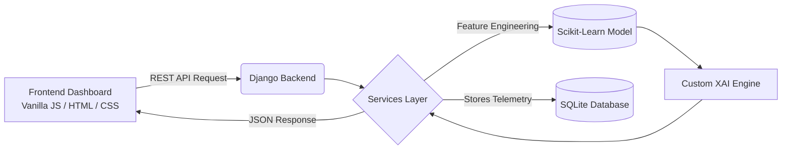

# 🔍 PersonaVerify: Explainable AI Profile Authenticity Classifier


**PersonaVerify** is an end-to-end Machine Learning web application engineered to detect fake social media profiles. Built with a focus on trust and transparency, it utilizes a `RandomForestClassifier` trained on account metadata and linguistic patterns. 

What sets PersonaVerify apart is its **Local Feature Interpretability Dashboard**, powered by a custom Explainable AI (XAI) engine that breaks down the "black box" of machine learning to show exact, mathematical reasons why a profile receives a specific authenticity score.

---

## 📑 Table of Contents
- [✨ Key Features](#-key-features)
- [🏗️ Technical Architecture](#-technical-architecture)
- [🧠 Explainable AI (XAI) Methodology](#-explainable-ai-xai-methodology)
- [🔌 API Reference](#-api-reference)
- [🚀 Local Development Setup](#-local-development-setup)
- [📂 Project Structure](#-project-structure)

---

## ✨ Key Features

1. **High-Accuracy Prediction Engine**
   - Utilizes a 100-estimator `RandomForestClassifier`.
   - Analyzes 11 core raw features, engineering them into 20 advanced metric ratios (e.g., Follower/Following ratio, alphanumeric username density, bio entropy).
2. **"White-Box" Explainability Dashboard**
   - Transcends basic predictions by rendering a localized, SHAP-style waterfall chart.
   - Converts log-odds shifts into human-readable percentage impacts for every individual feature.
3. **Bulk CSV Dataset Processing**
   - An optimized pipeline to parse multi-row `.csv` files via `pandas`, allowing for batch-inference of thousands of profiles concurrently.
4. **Persistent Telemetry Metrics**
   - SQLite-backed dashboard tracking the live statistical throughput of the model in production (Fake vs. Real classification volumes).

---

## 🏗️ Technical Architecture

The application is built using a decoupled client-server architecture:



- **Backend:** Django with Django REST Framework (DRF) acting as the prediction API layer. Uses a Singleton pattern for Model Loading (`model_loader.py`) to keep the Random Forest artifact cached in RAM.
- **Frontend:** A zero-dependency, data-science-style single-page application prioritizing a dense, technical UI.
- **Machine Learning Data Pipeline:** Developed in Jupyter Notebooks. Uses `StandardScaler` for normalization.

---

## 🧠 Explainable AI (XAI) Methodology

Traditional Random Forests output a singular confidence probability. PersonaVerify implements **Tree Decision Path Decomposition** to unpack this.

**How it works (inside `explainer.py`):**
1. The API receives a request and routes it to the specific nodes activated inside the Random Forest.
2. The engine traces the path taken through **all 100 decision trees** for the specific input profile.
3. At each node split, it calculates how the specific feature variable (e.g., `description_length`) shifted the probability array up or down.
4. It aggregates these shifts across the forest, proving exactly how much each feature contributed to the final percentage score.
5. The frontend plots these as a localized waterfall chart mapping positive and negative probability vectors.

---

## 🔌 API Reference

PersonaVerify exposes robust endpoints for downstream integrations:

### 1. Single Profile Prediction
**`POST /api/predict/`**
Analyzes a single JSON payload.
```json
// Request
{
  "profile_pic": 1,
  "nums_length_username": 0.12,
  "fullname_words": 2,
  "description_length": 45,
  "followers": 1500,
  "follows": 300,
  ...
}

// Response (200 OK)
{
  "prediction": "Real",
  "confidence_score": 0.985,
  "explainability": {
    "feature_contributions": [ ... ],
    "risk_factors": [ ... ]
  }
}
```

### 2. Bulk Dataset Inference
**`POST /api/predict-bulk/`**
Accepts a `multipart/form-data` payload containing a `.csv` file. Returns a mapped array of analysis results and aggregate totals.

### 3. Model Telemetry
**`GET /api/stats/`**
Returns total predictions, and segmented counts of target outcomes. 

---

## 🚀 Local Development Setup

### Prerequisites
- Python 3.9+
- pip

### 1. Clone the repository
```bash
git clone https://github.com/kushhcodes/PersonaVerify-AI-Profile-Classifier.git
cd PersonaVerify-AI-Profile-Classifier
```

### 2. Setup the Python Backend
```bash
cd backend
python -m venv venv
source venv/bin/activate  # On Windows use `venv\Scripts\activate`

# Install dependencies
pip install -r requirements.txt

# Run migrations for the Metrics database
python manage.py migrate

# Boot the API server
python manage.py runserver
```
*The backend model server is now running at `http://127.0.0.1:8000`.*

### 3. Launch Frontend Client
There is no build step required for the frontend. Simply open `index.html` located in the `/frontend` directory directly in your Firefox, Chrome, or Safari browser.

---

## 📂 Project Structure

```text
PersonaVerify/
├── backend/                  # Django REST API Directory
│   ├── predictor/            # Core ML application
│   │   ├── explainer.py      # Core XAI decision path decomposition
│   │   ├── model_loader.py   # RAM-optimized ML artifact caching 
│   │   ├── services.py       # Data validation & inference pipeline
│   │   └── models.py         # DB schema for Telemetry Tracking
│   ├── model/                # Contains pre-trained .pkl Random Forest weights
│   └── personaverify/        # Main Django router configuration
├── frontend/                 # Client UI
│   ├── index.html            # Data Science Dashboard Layout
│   ├── style.css             # Theme and styling definitions
│   └── script.js             # API interaction and Chart rendering logic
└── PersonaVerify_FakeProfileDetection.ipynb  # Original ML Training Notebook
```

---
*Built to bring interpretability to trust and safety algorithms.*
